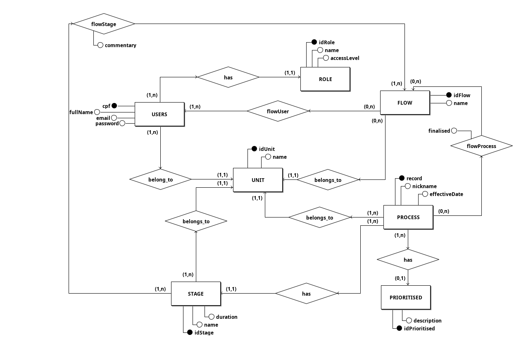
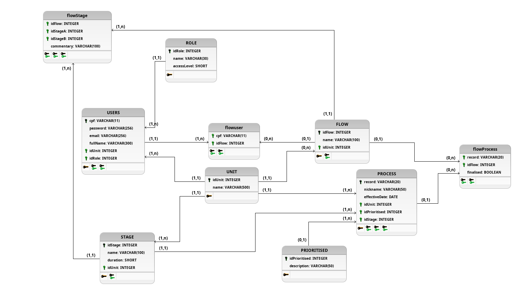

# Documento de Arquitetura

# 1. Introdução

## 1.1 Objetivo

O documento apresentado tem como finalidade oferecer uma visão abrangente da arquitetura do projeto. Dessa forma, utilizou-se visões arquiteturais que ilustram o desenvolvimento do sistema, contendo informações que compreendem as tecnologias envolvidas e suas interações. Logo, por intermédio deste documento busca-se esclarecer as decisões arquiteturais estabelecidas pela equipe durante o desenvolvimento do projeto.

## 1.2 Escopo

CAPJu é uma aplicação web que propõe a gerência de processos jurídicos e automatizar tarefas repetidas realizadas via planilha. Os processos passam por etapas, e a proposta da aplicação consiste em proporcionar ao usuário um controle e acompanhamento de cada processo, como por exemplo, movimentar processos de acordo com sua categoria e etapa. Este documento tratará dos padrões de arquitetura, tecnologias, *frameworks* e a integração entre esses mecanismos para o desenvolvimento dessa aplicação.

## 1.3 Definições, acrônimos e abreviações

| Sigla     | Significado                                       |
| --------- | ------------------------------------------------- |
| **CAPJu** | Controle e Acompanhamento de Processos da Justiça |
| **HTTP**  | Hypertext Transfer Protocol                       |
| **API**   | Application Programming Interface                 |
| **CSS**   | Cascading Style Sheets                            |
| **JSON**  | JavaScript Object Notation                        |

## 1.4 Visão Geral

Este documento detalha os padrões arquiteturais do CAPJu, como também aborda as tecnologias utilizadas para o desenvolvimento. Para isso, os documento foi estruturado da seguinte forma:

|       | Tópico                                | Descrição                                                                                                                    |
| ----- | ------------------------------------- | ---------------------------------------------------------------------------------------------------------------------------- |
| **1** | **Introdução**                        | Fornece ao leitor uma visão geral do conteúdo abordado no documento                                                          |
| **2** | **Representação da Arquitetura**      | Detalha a arquitetura utilizada no projeto e como ela está organizada                                                        |
| **3** | **Metas e Restrições da Arquitetura** | Descreve os objetivos do projeto, como também suas restrições, do ponto de vista arquitetural                                |
| **4** | **Visão Lógica**                      | Fornece ao leitor uma base para compreender a estrutura e a organização do design do sistema                                 |
| **5** | **Visão de Implementação**            | Fornece ao leitor uma base que permitirá compreender a distribuição física do sistema em um conjunto de nós de processamento |

# 2. Representação da Arquitetura

## 2.1 Tecnologias

No que diz respeito às tecnologias que serão necessárias para o desenvolvimento temos as seguintes:

### React

O React é uma biblioteca JavaScript de código aberto com foco em criar interfaces de usuário em páginas web.

### Jest

Jest é um *framework* de testes em JavaScript. Possui suporte a análise de cobertura de código e às principais bibliotecas e extensões da linguagem, como Babel, Typescript, Node, React e Angular.

### Styled-Components

Styled-components é uma biblioteca para React e React Native que permite que você use estilos ao nível de componente na sua aplicação. Eles são escritos em uma mistura de JavaScript com CSS.

### NodeJs

Node.js é um software de código aberto, multiplataforma, baseado no interpretador V8 do Google e que permite a execução de códigos JavaScript fora de um navegador web.

### ExpressJs

Express.js é um *framework* para Node.js que fornece recursos mínimos para construção de servidores web. Foi lançado como software livre e de código aberto sob a Licença MIT. É um dos mais populares *frameworks* para servidores em Node.js.

### Sequelize

O Sequelize é uma ferramenta ORM Node.js baseada em *promises* para Postgres, MySQL, MariaDB, SQLite, Microsoft SQL Server, Amazon Redshift e Snowflake's Data Cloud. Possui suporte a transações, relacionamentos, replicação de leitura e muito mais.
O Sequelize segue o controle de versão semântico e oferece suporte ao Node v10 e superior.

### Postgres

O PostgreSQL é um poderoso sistema de banco de dados objeto-relacional de código aberto que usa e estende a linguagem SQL combinada com muitos recursos que armazenam e dimensionam com segurança as cargas de trabalho de dados mais complicadas.
O PostgreSQL pode ser executado em todos os principais sistemas operacionais, além de ser o banco de dados relacional de software livre preferido por muitas pessoas e organizações.

# 3 Metas e Restrições da Arquitetura

## 3.1 Metas

- Reusabilidade de código
- Baixo acoplamento, facilitando a manutenção futura do código
- Tornar o desenvolvimento do aplicativo mais rápido

## 3.2 Restrições

- Depende de uma conexão com a internet
- Possuir conexão com o serviço de back-end por API HTTP;
- Possuir conexão com o Banco de Dados.

# 4. Visão Lógica

## 4.1 Visão Geral

<iframe src="https://drive.google.com/file/d/1ZpKmk2o6XDKuMmHA0F0dEAvVpxeu7RWr/preview" width="640" height="480" allow="autoplay"></iframe>

O servidor é dividido em dois microsserviços, um para a gerência de perfis e usuários e outro para a gerência de fluxos e processos. Cada um conectando-se ao mesmo banco de dados e executando em nodeJs com expressJs.

O projeto CAPJu utiliza uma arquitetura **MVC baseada em microsserviços**.  A sigla MVC vem dos termos em inglês Model (modelo) View (visão) e Controller (Controle). Essa arquitetura facilita a troca de informações entre a interface do usuário e dados no banco, fazendo com que as respostas sejam mais rápidas e dinâmicas. A base em microsserviços separa a camada de Visão da de Modelo e Controle em programas diferentes e independentes.

A camada **Model** possui a responsabilidade da lógica/regra de negócio, de cada módulo, após fazer o tratamento dos dados, é feito mais um mapeamento para o banco de dados, que fará o processamento requisitado e irá retorná-lo. Para essa camada será utilizado o **Sequelize**.

A partir da camada **View**, o cliente através de uma aplicação web, terá acesso a uma interface e poderá realizar requisições ao sistema quando for necessário interagir com o banco de dados. O **React** será responsável pela camada View.

Como mencionado anteriormente, a camada de visão será executada independentemente do back-end, aderindo a uma arquitetura de microsserviços.

A camada **Controller** será responsável por intermediar as requisições enviadas pela camada View com as respostas fornecidas pela camada Model, processando os dados que o usuário informou e repassando para outras camadas. Nessa camada será utilizado o **NodeJs** e **expressJS**.

# 5. Visão de implementação

## 5.1 Diagrama de Entidade e Relacionamento

## 5.2 Diagrama de Dados

# Referências

* Capju. Capju. Documento de arquitetura. Disponível em: https://fga-eps-mds.github.io/2022-1-CAPJu-Doc/#/projeto/documento-arquitetura. Acesso em: 10 de dez. de 2022.

* Sequelize. Sequelize. Página inicial. Disponível em: <https://sequelize.org/docs/v6/>.Acesso em: 10 de dez. de 2022.

* Marcio. Padrão MVC - Java Magazine. Devmedia, 2011. Disponível em: <https://www.devmedia.com.br/padrao-mvc-java-magazine/21995>. Acesso em: 25 de jul. de 2022.

* ZUCHER, Vitor. O que é padrão MVC? Entenda arquitetura de softwares!. lewagon, 2020. Disponível em: <https://www.lewagon.com/pt-BR/blog/o-que-e-padrao-mvc#:~:text=O%20MVC%20%C3%A9%20uma%20sigla,sejam%20mais%20r%C3%A1pidas%20e%20din%C3%A2micas>. Acesso em: 25 de jul. de 2022.

* Jest. Jest. Página inicial. Disponível em: <https://jestjs.io/pt-BR/>. Acesso em: 25 de jul. de 2022.

* React. React. Página inicial. Disponível em: <https://pt-br.reactjs.org/>. Acesso em: 25 de jul. de 2022.

* Express.js. Wikipedia. Disponível em: <https://pt.wikipedia.org/wiki/Express.js>. Acesso em: 25 de jul. de 2022.

* NodeJS Contributors. NodeJS. Disponível em: <https://nodejs.org/en/>. Acesso em: 06 de fevereiro de 2023.

* Style Components Contributors. Styled Components. Disponível em: <https://styled-components.com/>. Acesso em: 06 de fevereiro de 2023.

* The PostgreSQL Global Development Group. PostgresSQL. Disponível em: <https://www.postgresql.org/>. Acesso em: 06 de fevereiro de 2023.

# Histórico de versões

| Data       | Versão | Descrição                                                                   | Autor                                        |
| ---------- | ------ | --------------------------------------------------------------------------- | -------------------------------------------- |
| 11/12/2022 | 0.1.0  | Adicionando o tópico de Introdução e Objetivo                               | João Vitor Alves e Lude Ribeiro              |
| 06/02/2023 | 0.2.0  | Remover bibliotecas não usadas e atualizar modelagem do BD                               | Davi Antônio da Silva Santos                 |
| 06/02/2023 | 0.2.1  |Revisão do documento                              |  Antônio Aldísio                 |
