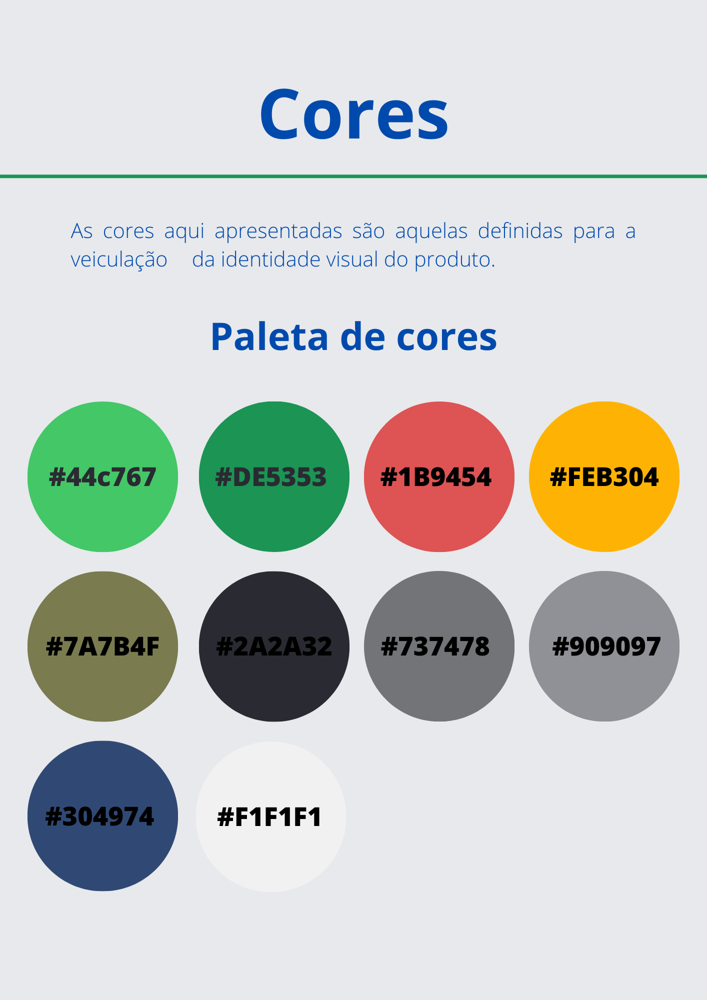
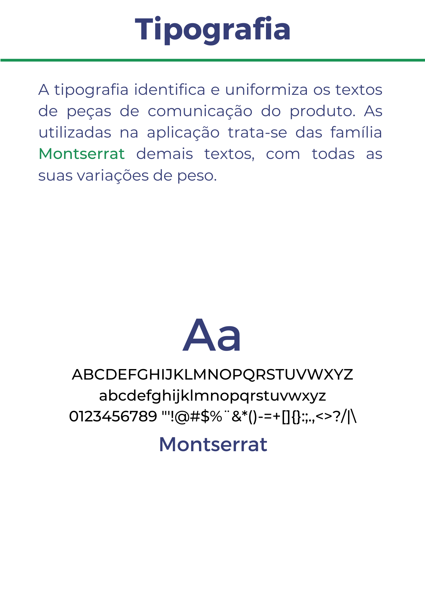

# Identidade Visual

    <figure>
        
    </figure>
    <figure>
        
    </figure>
    <figure>
        
    </figure>
    <figure>
        
    </figure>
    <figure>
        
    </figure>

**Histórico de Versão**

| Data       | Versão | Descrição                    | Autor(es)         |
| ---------- | ------ | ---------------------------- | ----------------  |
| 22/07/2022 | 0.1.0  | Criação do documento         | Francisco, Maicon |
| 03/02/2023 | 2.0.0  | Alteração da paleta de cores | Chaydson, Samuel  |

## Referências

> How to create a visual style guide for your brand. Disponível em: https://www.canva.com/learn/your-brand-needs-a-visual-style-guide/